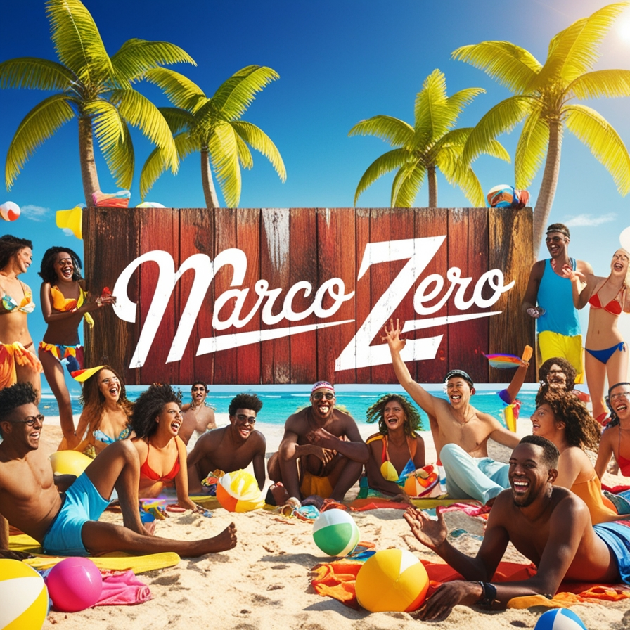
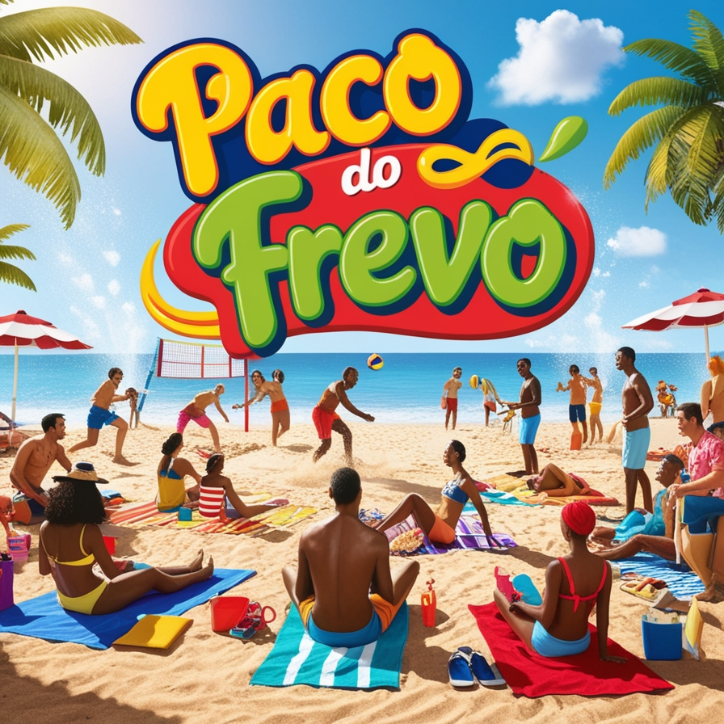
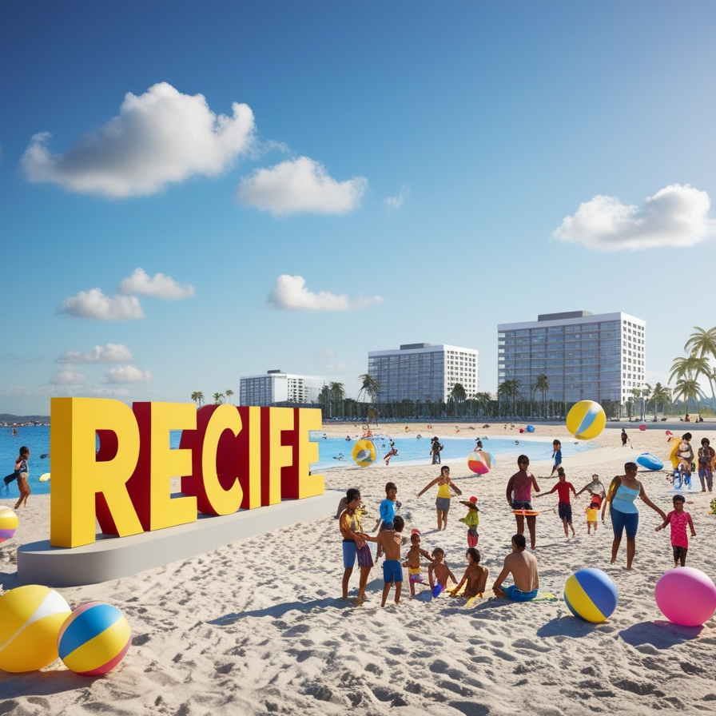

# 📜 Desenvolvimento 01

## 🎯 Descrição do Projeto

Com a página sobre o Marco Zero feita, é necessário de uma outra página e de um link que leve até ela. Na nova página, fale sobre dois outros pontos turísticos do Recife Antigo e siga os pré-requisitos a seguir: 

 1. crie um link que irá direcionar para essa nova página; 
 2. adicione imagens sobre os lugares. 

## 🛠️ Resolução

```
<!DOCTYPE html>
<html lang="pt-BR">
<head>
    <meta charset="UTF-8">
    <meta name="viewport" content="width=device-width, initial-scale=1.0">
    <title>Marco Zero - Recife</title>
    <link rel="stylesheet" href="./global.css">
</head>
<body>
    <header>
        
        <h1>Bem-vindo ao Marco Zero de Recife 2.0</h1>
    </header>

    <main>
        <section>
            <h2>Sobre o Marco Zero</h2>
            <div class="content">
                <p class="text-marco">O <b style="color: blue;">Marco Zero</b> é um dos pontos turísticos mais icônicos de Recife. Localizado no centro histórico da cidade, ele marca o início das principais vias que levam aos diversos bairros da capital pernambucana.</p>
                
            </div>
        </section>
        
        <section>
            <h2>O que fazer no Marco Zero?</h2>
            <div class="content">
                
                <p class="text-frevo">No entorno do Marco Zero, você pode encontrar várias atrações culturais, como o <b style="color: red;">Paço do Frevo</b>, exposições de arte e apresentações ao ar livre. Além disso, a vista para o Recife Antigo e o porto é simplesmente deslumbrante.</p>
            </div>
        </section>

        <section>
            <div class="content">                    
                <a style="color: aqua;" href="./info-viagem.html">Praia de Boa Viagem</a>
                
            </div>
        </section>

        <section>
            <div class="content">
                
                <a style="color: darkgreen;" href="./info-jaqueira.html">Parque da Jaqueira</a>
            </div>
        </section>
    </main>

    <footer>
        <p>26/11/2024 - Exercício HTML / CSS</p>
    </footer>
</body>
</html>
```

