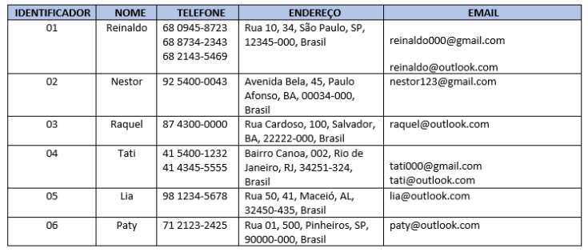

# 📜 Desenvolvimento 03 

## 🎯 Descrição do Projeto 

Instruções do projeto
A normalização de dados é um processo realizado nas tabelas para evitar anomalias. Com base no conteúdo visto no Hipertexto 3, transforme a tabela em anexo na Primeira Forma Normal (1FN).

## 🛠️ Resolução

### 📌 Tabela: Endereço  

| Identificador | Logradouro   | Número | Cidade         | UF | País   | CEP        |
|--------------|-------------|--------|---------------|----|--------|------------|
| 1            | Rua 10      | 30     | São Paulo     | SP | Brasil | 12345-000  |
| 2            | Av. Bela    | 45     | Paulo Afonso  | BA | Brasil | 00034-000  |
| 3            | Rua Cardoso | 100    | Salvador      | BA | Brasil | 22222-000  |
| 4            | -           | 2      | Rio de Janeiro| RJ | Brasil | 34251-324  |
| 5            | Rua 50      | 41     | Maceió        | AL | Brasil | 32450-435  |
| 6            | Rua 01      | 500    | Pinheiros     | SP | Brasil | 90000-000  |

---

### 📌 Tabela: Contato  

| Identificador | Nome     | Telefone      | Email                   |
|--------------|---------|--------------|-------------------------|
| 1            | Reinaldo | 68 0945-8723 | reinaldo000@gmail.com   |
| 1            | Reinaldo | 68 8734-2343 | reinaldo@outlook.com    |
| 1            | Reinaldo | 68 2143-5469 | -                       |
| 2            | Nestor   | 92 5400-0043 | nestor123@gmail.com     |
| 3            | Raquel   | 87 4300-0000 | raquel@outlook.com      |
| 4            | Tati     | 41 5400-1232 | tati000@gmail.com       |
| 4            | Tati     | 41 4345-5555 | tati@outlook.com        |
| 5            | Lia      | 98 1234-5678 | lia@outlook.com         |
| 6            | Paty     | 71 2123-2425 | paty@outlook.com        |
