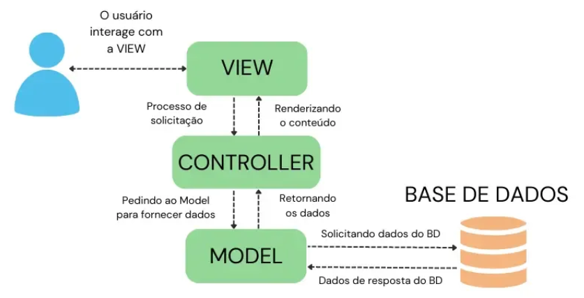

# 📜 Desenvolvimento 05

## 🎯 Descrição do Projeto 

Pesquise uma ilustração que representa a arquitetura cliente-servidor e, com base na imagem, explique o seu funcionamento.

## 🛠️ Resolução

## 🏗 Arquitetura MVC (Model-View-Controller)

A arquitetura **MVC (Model-View-Controller)** é um padrão de design utilizado no desenvolvimento de software para separar a lógica da aplicação em três camadas principais: **Modelo (Model), Visão (View) e Controlador (Controller)**. Esse padrão melhora a organização do código, facilita a manutenção e promove a reutilização de componentes.

## 🔹 **Componentes do MVC**

### 🏛 **1. Model (Modelo)**
- Representa os **dados** e a **lógica de negócios** da aplicação.
- Se comunica com o banco de dados.
- Processa regras de negócio antes de enviar os dados para o Controller ou View.
- **Exemplo:** Em um sistema de usuários, o Model gerencia informações como nome, e-mail e senha.

### 🖥 **2. View (Visão)**
- Responsável pela **interface gráfica** e exibição dos dados ao usuário.
- Se comunica apenas com o Controller para receber dados do Model.
- Normalmente usa tecnologias como **HTML, CSS e JavaScript** em aplicações web.
- **Exemplo:** Uma página HTML que exibe a lista de usuários cadastrados.

### 🎮 **3. Controller (Controlador)**
- Atua como um intermediário entre o **Model** e a **View**.
- Recebe **requisições** do usuário e decide como tratá-las.
- Solicita os dados ao Model e os envia para a View renderizar.
- **Exemplo:** Um controlador que processa um formulário de login e verifica se o usuário existe no banco de dados.

## 🔹 **Fluxo de Funcionamento**
1. O usuário interage com a **View** (exemplo: clica em um botão).
2. A **View** envia uma requisição para o **Controller**.
3. O **Controller** processa a requisição e aciona o **Model** para buscar ou manipular os dados.
4. O **Model** retorna os dados ao **Controller**.
5. O **Controller** repassa os dados para a **View**.
6. A **View** exibe os dados processados ao usuário.

## 🔹 **Vantagens do MVC**
✅ **Separação de responsabilidades** – facilita manutenção e escalabilidade.  
✅ **Reutilização de código** – componentes podem ser reaproveitados em diferentes partes do sistema.  
✅ **Facilidade na colaboração** – diferentes equipes podem trabalhar separadamente na Model, View e Controller.  

## 🔹 **Exemplo Prático em uma Aplicação Web**
- O usuário acessa um site e preenche um formulário de login (**View**).
- A **View** envia os dados para o **Controller**.
- O **Controller** valida os dados e os repassa para o **Model**.
- O **Model** verifica no banco se o usuário existe e retorna a resposta ao **Controller**.
- O **Controller** decide se redireciona o usuário para o painel ou exibe uma mensagem de erro na **View**.
