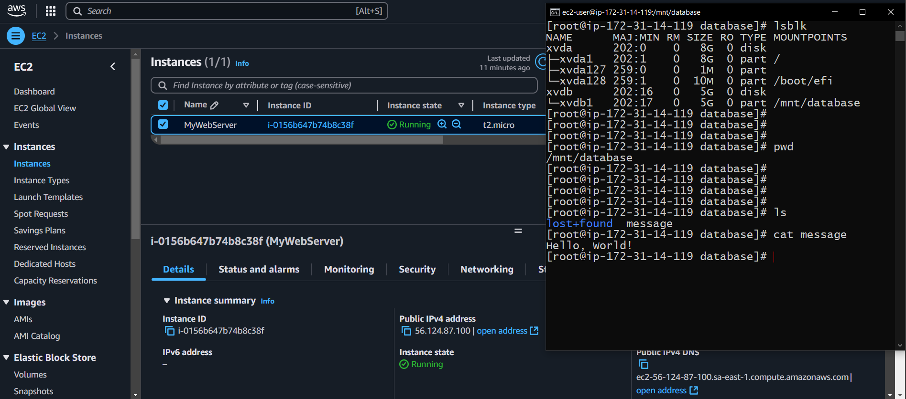

# 📜 Desenvolvimento 02

## 🎯 Descrição do Projeto 

A banda de Miguel te contratou para ajudá-los na criação de uma instância EC2 para organizar a documentação e os arquivos importantes da banda. Recentemente, a banda se interessou pelo mundo da computação em nuvem e decidiu explorar o Amazon EC2, um serviço popular de infraestrutura como serviço (IaaS) oferecido pela Amazon Web Services (AWS). Eles também conheceram o Amazon Linux, que é uma distribuição otimizada para a nuvem, sendo uma opção excelente para as instâncias EC2. Os membros da banda estão empolgados para testar essa tecnologia e começar a armazenar e gerenciar os seus documentos e arquivos na nuvem. Neste exercício, iremos ajudá-los com isso.

Exercício:
- Configuração da instância EC2
  - Acesse o Console da AWS e navegue até o serviço EC2; 
  - Crie uma nova instância EC2 usando a imagem Amazon Linux 2; 
  - Defina sua instância com base em suas necessidades de recursos. 

- Conexão via SSH
  - Conecte a instância via SSH;
  - Execute os comandos necessários para acessar o terminal da instância.

- Gerenciando o armazenamento
  - Explore as opções de armazenamento oferecidas pelo Amazon EC2; 
  - Crie um novo volume Elastic Block Store (EBS) com um tamanho de sua escolha e anexe o volume à sua instância EC2. 

- Formatando e montando o volume
  - Formate o volume recém-criado usando um sistema de arquivos de sua escolha;
  - Monte o volume em um diretório específico em sua instância.

- Criação de arquivos
  - Crie um arquivo de texto simples usando o editor de sua preferência;
  - Salve esse arquivo no volume montado.

- Explorando recursos:
  - Use comandos, como ls, df -h, pwd, su passwd, mount e cat, para verificar o status do volume montado, o espaço em disco disponível e o conteúdo do arquivo criado;
  - Tire um print deste último passo e envie para avaliação.

> Atenção: após executar o exercício, não se esqueça de interromper ou encerrar a instância criada para não gerar custos adicionais.

## 🛠️ Resolução

### Instância on-line com volume extra

